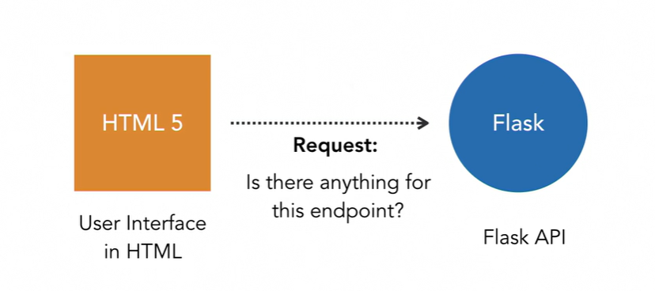
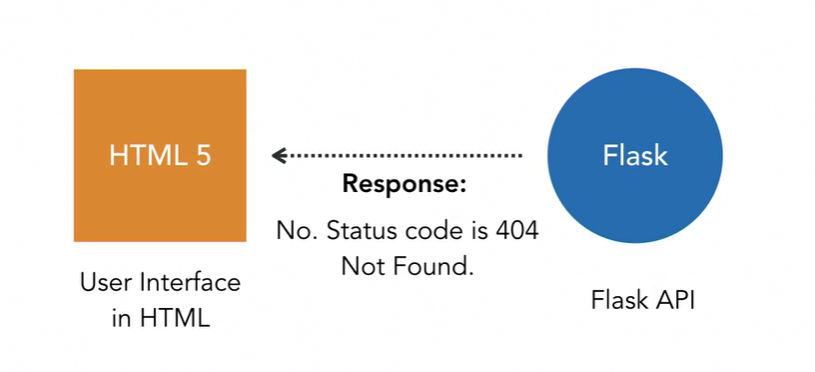

### Flask
* You'll find a set of import statements. These give our code access to third party libraries, as well as the large library of capabilities that comes with Python. In this case, you can see we're importing Flask. After that, you can see we have a variable called app, that's being set to the result of the Flask constructor. We're passing in underscore a name, which means this particular app will take its name from the name of the script. If you like, you can change this to some hard coded string value, I'm going to leave mine alone. Next, we have this funny looking line that starts with an @ symbol. This indicates a decorator in Python, just like it does in many other languages. A decorator is a way of giving special capabilities to our functions. In this case, this line is defining the route for our endpoint. Remember, an endpoint is just a URL. In this case, we're responding to the site root. In your traditional HTML website, the root would be whatever is in index.html, it's the default content for the site. Here, it contains our Hello World function. So the decorator decorates the function and the function just returned the text Hello World. Below that is a very traditional underscore name test. If you've worked with Python for scripting, you've seen this before. All it does is serve as an entry point when you run the script, which we'll be looking at doing in the next video. But let's not get ahead of ourselves. Let's use our newfound knowledge of routing to create a new endpoint. I'm just going to click here on line nine. And I'm going to press Enter twice. If you're new to Python, let me tell you spacing is very important. There are no curly braces like in most C based languages. PyCharm has a built in linter that will warn you if you make any formatting mistakes, both to save you from syntax errors and also to help you write proper Python code. One of the rules PyCharm tries to enforce is that there should be two empty lines between any two functions. Now that I've got my two empty lines, let's go ahead and create our route, which for now I'm going to call super simple. So I'll add the @ sign @app.route. And then in the parenthesis as a string argument, I'm going to type in super_simple. Next, I need to go ahead and create the function for this. So on the next line, I'll type in def, and I'll call it super_simple again. And I'll do the exact same thing that we're doing up above in the Hello World example. I'll return some text. In this case, I'll say 'Hello from the Planetary API.' I can see down on line 15 I've got a yellow squiggly let me hover over it. And it's going to tell me that it expects two blank lines after the function definition and it only found one. So let's add one more, and it should go away. Perfect. Generally, PyCharm saves your work automatically. But I'm in the habit of pressing Control + S from time to time and there we go. As promised, you created a new route in your API in just a few minutes.
* Flask, like many web development frameworks comes with its own built-in development web server. You definitely don't want to use this in production though, because it can be very brittle. But it's very convenient for development work. There are two ways to run your project. The first is to run it from the Terminal. If you open the Terminal window in PyCharm, you'll see the default shell for your operating system. On the Mac it's Bash, and on the PC it's usually PowerShell. The commands are the same in either environment. You might have noticed that the prompt here has something in front of it, in my case it's venv in parentheses. The virtual environment we created when we created the project needs to be activated. When you work in PyCharm it does this for you automatically, and you can tell the virtual environment is active because of the display in front of the command prompt. From the command prompt simply type in python then the file you want to run, in this case, it's app.py and press enter. This starts the Flask development web server and you can see after it starts we have a running server bound to a port on local host. That's the manual way to start the server. To stop it press Ctrl + C PyCharm also has a feature called Run Configurations that allow PyCharm to work more like most IDEs you might have used in the past like Visual Studio, Eclipse, or Xcode. Now PyCharm is already set up to Run Configuration for us.
* I can see it up here where it says planetary-api, but I want to make sure you know how to make these yourself. So lets go ahead and click the down arrow here, and select Edit Configurations and we'll add our own. I'll click the plus sign over here I'll select Flask_server and I'll give it a nice descriptive name like Run API Project. Next I need to set what I want this Run Configuration to do. In this case I just want it to run a script. So I'm going to change the Target type to Script path and then I'm just going to browse to the app.py file. And that's it ill click Apply and then okay. I can now run this Run Configuration with it selected here, by clicking the green arrow right next to it. Like before I'm going to see a Terminal window down here and it's going to say that it's running on local host port 5000. Its worth mentioning that the fine folks at JetBrains choose red to be one of the default colors of text for dark themes, I always use to freak out when I'd hit run because I'd get all this red text. But in this case that's fine and normal. Like before we can see our app is running on local host port 5000.
* So at this point, we have executed two different requests to two different endpoints. Let's switch back over to PyCharm and take a look at the window down at the bottom. Note that I can see the requests that have been executed against this server. I can tell the verb that was used. I can tell the route that was used. What version of HTP it's working with, in this case it's 1.1. And I can see the status code at the end. 200, which means okay. Everything worked just fine. If there were problems with the request, you'd see them in Postman, but you'll also see them here in the run window.
### Restarting Server
* As we edit the file in our project, naturally we'll be switching between PyCharm and Postman quite often. And in order to see your changes, you'd need to restart your server. That's actually pretty easy. I left my server running in the last video. Let's make a quick change to the text returned by our super_simple function. I'll come into Line 13, and I'll just add some text to the end. I'll say boo yah. I'll go ahead and hit Control S to save it, and I'll switch back over to Postman, and I'll click the send button, since it already has the super_simple URL in it already. And you'll note that we don't see the extra text here. That's because in order to see it, we really need to reload our server. I'll switch back over to PyCharm, and I'll show you that PyCharm has a very convenient way of restarting your server. Just come down to the Run window, and you'll see that there's a Restart button, located right above the Stop button. So I'll go ahead and click this, and I can see that the server restarted. Let me switch back over to Postman, and I'll send the request again. And now I can see by boo yah text. As convenient as that is, it's not ideal. If you've ever worked with Node.JS, you've undoubtedly been spoiled by the Node servers that use libraries like Nodemon to automatically reload the app whenever anything changes. Flask has this capability as well. Flask is based on another library called Werkzeug. Werkzeug is the source of our development server and it supports auto reloading whenever it detects a particular environment variable in your system. Environment variables are just variables that you can set in the operating system and they can be different on any server. This is a great way to store configuration information like database connection strings, API keys, and anything else you don't really want in your code. Let's switch back over to PyCharm, and let's tweak the settings in our project. I'll go ahead and stop the running server, and I'll go into the Run configuration again. So I'll come up here, select Edit Configurations, and you can see towards the middle here, that we have some options for environment variables. Now you can set environment variables wholesale down here in the Environment variables section, but the ones that we need are actually presets in PyCharm. So the first one is FLASK_ENV. What environment type are we running here? It defaults to development, which is perfect because this is a development server. The second is FLASK_DEBUG. This is just a boolean, and you can turn it on and off using the little checkbox. So I'm going to turn this on, and I'll click apply, and then I'll click OK. When you check that box, you turned on Debug mode in Werkzeug. When you run your app, the app will then lazily reload whenever it detects changes in the Python code files. Let's give it a try. I'll go ahead and start my server back up again. I'll switch back over to Postman, and I'll click Send. And I can still see that the boo yah is here. I'll switch back over to PyCharm, and I'll take the boo yah text out. I'll save my work, and now it's going to lazily reload whenever it detects that change. And I can see it restart there. Let me switch back over to Postman to test it.
### Return Data
* So far we have two really simple endpoints, both of which are returning plain text. While there's nothing inherently wrong with this, restful APIs are generally expected to return JSON, or JavaScript Object Notation, rather than just a string. So let's modify our code so that instead of returning text, we're returning valid JSON. Let's go into our code, and we're going to modify our super simple route so that it returns JSON. All I'm going to do is add just one little function call, and it's called jsonify. And what I'll do here, is I'll set message equal to, and then I'll just keep the text that's there. Now the jsonify function has a red line under it because although it's part of Flask, I didn't actually import it explicitly. So let's go to the very top of our file, and lets add another import from Flask. So we're going to import Flask and we're going to import jsonify. Now if I scroll back down I'll see that that red line is gone and we're ready to test this. I'll go ahead and save my work. I can see my server restart, and I'll switch back over to Postman. In Postman my route is already setup from the previous video. So it's set to a get request. It's going to locahost:5000/super_simple. So this is all ready to go. I'll just click send, and note that right now it's just plain text. I'll click send, and now it comes back as valid JSON. So JSON if you've never used it, is sort of the replacement for XML, and it's just key value pairs for the data that you want to represent. In this case we have a key called Message and then the message value is Hello from the Planetary API. If we switch back over to PyCharm, you can see how this works. You just type in the attribute name that you want, in this case Message, and then equals, and then whatever you want the value to be. If you wanted to add more, you could just separate them with colons.
* Working with Status Codes
  * All web apps are based on a request-response mechanism.
  * Requests and responses have headers
  * Headers contain useful but invisible metada that is not obvious to your end users.
  * The status code in the header will tell you whether your request was successful or not.
  * Status codes in HTTP will tell you whether or not your request was actually successful or not. Most of the time it is and the status code shows as 200 as we saw in Postman. The valid status codes are defined in the HTTP specification. And it's an easy thing to Google the status codes to find out what they are. In our earlier example, the response defaulted to a code of 200 okay. Status codes are useful because if I have a UI that's calling this end point, the calling program needs to know whether any problems with the request. So it might look something like this. An HTML JavaScript app serving as the user interface makes a request to Flask, "Hey API, "do you have anything for this end point?" To which Flask will reply, "Yes, I do." "Here's some data in the JSON format "and the status code is 200 okay."
  

  * But what happens if it's not there? "Hey API, do you have anything for this other end point?" "Um, no, I can't find anything at that address. "The status code is 404 not found." The status code is useful because if you have UI code that's calling the end point, the calling program needs to know if there are any problems with the request.
  
  * , "That resource was not found." And then the pivotal point of the code, I'll go to the end and I'll add 404, which is the HTTP status code for not found. Now, if I wanted to I could come up here to line 13 and explicitly add 200 here but I don't really have to because it's going to default to that. Some people like to use explicit values everywhere. And so that's how you'd do it if you wanted to go that route, no pun intended
### Working with URL Parameters
  * GET requests can do more than just get a simple address. They can also pass data to the server for processing your request, allowing you to present dynamic content to your users based on the URL parameters passed in. Consider this URL, it's a very simple URL with no parameters on it. We can add parameters to the end by adding a question mark followed by a series of key-value pairs. This allows your front-end to pass in variable information directly to your endpoint.
    * http://www.maddevskilz.com/
    * http://www.maddevskilz.com/?s=bruce
  * Let's look at how to support parameters on our endpoint URLs. Back in Pycharm I'll add my new route which I'll call parameters. I'm going to do that at line 19. I'll just add a couple of spaces here and I'll add my definition. You don't have to do anything special in the endpoint definition. The magic happens inside the decorated function. So I'll create my function definition. And inside the function body I'll create two normal Python variables. In each case I'll reference the request object followed by the parameter name that I want to use. The request object is tracked by Flask automatically and it gives you access to every piece of metadata you could imagine on the URL request it's matching.
  * The request object is generally always available in your endpoint functions but we do need to add an import statement in order to use it.
### Endpoint Variable Rules
  * http://localhost:5000?name=Jack&age=28
  * http://localhost:5000/Jack/28
  * normal URL parameters work by adding key value pairs after a question mark within the URL structure. The downside to this is that it can lead to long unattractive URLs in your application. Modern APIs usually feature a cleaner URL structure versus what we saw before. It's just another touch of detail that separates solid work from just good enough to ship. Flask supports foregoing the use of the normal syntax for parameters and instead it allows you to create rules for matching variable parts of the URL. This means that certain parts of the URL can be variable or in other words, not hard coded. These URL variables become arguments in your endpoint function.
  * . To define an endpoint with variables, we add angle brackets and within them, we specify the name of our parameter. Here I'm going to mimic what we did in the earlier example where we took in name and age. So, I'll add two URL variables here. And these are basically rules that tell Flask that we can match these with pretty much anything. So, these parts of the URL don't have to be hard coded in order to be matched. You can also specify a conversion filter to limit the type of data the endpoint accepts. Let's do this here. For name, I want to accept a string, so I'll type in string: in front of the variable name. And now for age, I'll type in int for an integer. Note that strong in front of name is not the usual Python abbreviation for the word string which is usually str. These are Flask functions and so, they have slightly different names. When you're ready to define the function, you need to make sure that the method signature on the function contains the same number of arguments as are in your endpoint URL. So, in this case, I'll add the argument's name and I'll go ahead and specify the type here in Python and then the same thing for age
  
