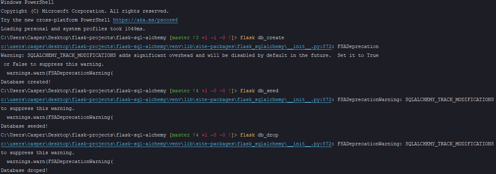

### Working With Databases:
* An API wouldn't be much of an API if all it did was pass back hard coded text. Most of the time your API will probably be creating, reading, updating and deleting records of some kind. The most common way to do this is to use relational database, but we could use a new SQL database like Mongo, or some other type of object storage. For our API, we're going to use a relational database because they're easily the most common. We'll be using SQLite for our database.
* We are going to use SQLite
* It is a file base database system (no server required)
* Not softwer installation is required to use SQLite
* We are also going to use an object relational mapper (ORM) called SQLAlchemy.
* Works with Python objects, not SQL
* Allows you to switch your database easily.
* You can control the structure of your database from your code, which can be managed by a revision control system like Git or Subversion
* Supports multiple database platforms.
* We have our database structure in our code, but we need a way to manage our database file. Typically, what you see is a script that creates the database from class definitions, a script that destroys the database so you can start from scratch for testing, and a seed script that enters some initial data for you to work with. With the 1.0 release of Flask, we got a new tool, the Flask command line interface, or CLI. The CLI allows you to run arbitrary commands against your app. This is actually how we're starting our dev web server right now, but PyCharm has handled all those details for us. We'll start by adding a few commands.

* SQLAlchemy makes this a one liner so I'm going to create a variable called planets list, and I'm going to set that equal to Planet.query.all. We're getting this function from SQLAlchemy, now we have a return value from our database client assigned to a variable.
* Werkzeug, Werkzeug is a Python web services gateway interface or WSGI for short. Werkzeug is responsible for actually serving up our data in response to the endpoint definitions we've made in Flask. Flask is usually used to develop traditional template-based HTML sites and this error page belies this fact by giving you a gigantic page full of HTML.
* TypeError: Object of type Planet is not JSON serializable // Werkzeug Debugger
  * So what this is telling me is that Flask.JSON can't convert the data we passed into the function into actual JSON the normal JSON serializers work with Python dictionaries but this isn't strictly speaking a Python dictionary. There are a couple of things we could try, we could iterate over the result set and generate an array of simple Python dictionary key value pairs, we could also add a method to our classes that allows us to translate the results into JSON.
* The process of converting an object into a textual representation of that object is called serialization. The process of converting the text back into an object is called deserialization. We need to figure out how to serialize a collection of SQLAlchemy data rows. The best answer I think is to use a third-party library since one already exists specifically for this purpose. If you go into PyPy at PyPy.org, you can do a search on Marshmallow, specifically Flask-Marshmallow.
  * Marshmallow is a serialization library for Python and naturally somebody came along and made a Flask variate that depends on it. And we can see in the project description that it's an integration layer for Flask and Marshmallow and we can see that it automatically or is well designed to integrate with Flask SQLAlchemy which is what we're using.
  * https://flask-marshmallow.readthedocs.io
  * Mostly I was interested to see whether I had closed my parenthesis or not and I did. Now that we've got our two schemas classes careted, we need to go ahead and instantiate them and what I'm going to do here is I'm going to instantiate two different copies, two different versions of each schema. So, I'll start with user_schema which is just my variable name and I'm going to set that equal to UserSchema like so and then I'm going to make a second one called users, plural, schema and I'll instantiate that one as UserSchema again but this time I'm going to pass in an extra parameter. Many equals True. What we're doing here is we're defining the ability to deserialize a single object as when you get one planet back later on when we make the route for that, maybe for the details versus getting a collection of records back which is what we're doing right now. So, if you're expecting one record back, we're going to use user_schema, if we're going to get multiple records back, we're going to use users plural schema. We'll do the same thing for planet, so we'll say planet_schema equals PlanetSchema and planets plural schema equals PlanetSchema. Many equals True. So now we got Marshmallow al.
  * We just now need to change our route that we careted earlier so that it uses Marshmallow to deserialize our result set. 
  * , I'll deserialize it with Marshmallow. So, I'll create a variable called result and I'LL set that equal to planets plural schema.dump and then I'll pass in planets_list. So I'm passing in the result set that came back from the database call.
