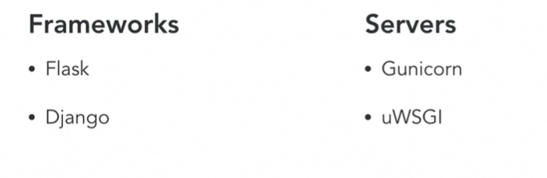
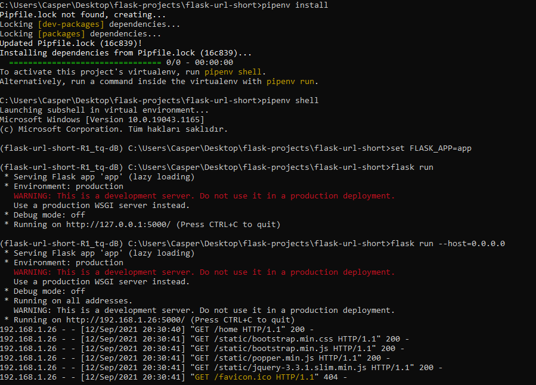

### Blueprints
* Testing allows us to make sure that whenever we make changes to our project, that we can be confident that the code that we've written is unaffected and will still work for our users.
### WSGI (Web Server Gateway Interface)
* WSGI is essentially a protocol for Python applications in order to serve websites in a uniform manner.
* So within WSGI you have essentially frameworks and servers. Some examples of Python frameworks are going to be Flask, or Django. And some examples of servers are going to be things like Gunicorn, and uWSGI. And essentially what WSGI allows is to say if we have some sort of Python framework that wants to ultimately serve webpages, if it follows the WSGI format that means that any Python framework you choose can work with any compatible WSGI server, like Gunicorn, uWSGI, and there's a whole list of both sides of your framework and servers, I'm just sharing some of the most common. But essentially, WSGI is a protocol. It's not something special that you have to install. Flask and Django by default implement those, same as Gunicorn and uWSGI. So as we move forward and deploy our project, although we've written it in Flask we're going to integrate it with Gunicorn so that Gunicorn can ultimately be the one that's serving up our files.
* 
* Deploying a project simply means that you want to upload your code to a server somewhere that will always be on and available and be able to share your website with everybody. So, if you try and run your server just on your computer and share it with everybody, maybe your computer shuts down, maybe you have a laptop that's not always on all the time. It's really important to have a server somewhere that's running your code.
* 
* gunicorn run 8000 port.